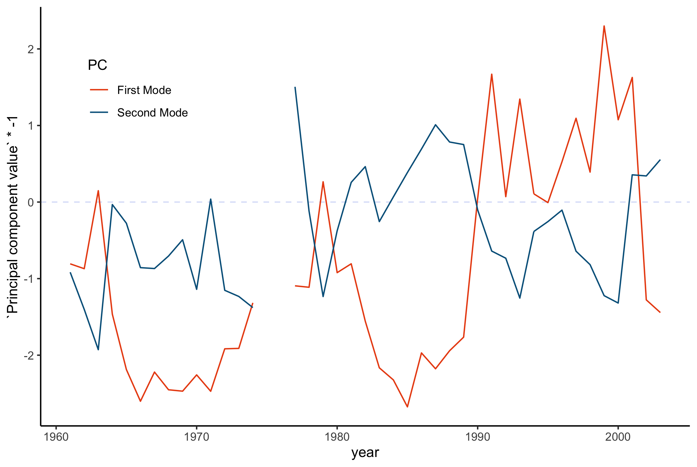
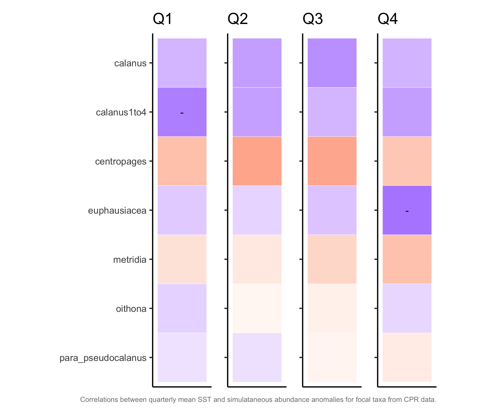
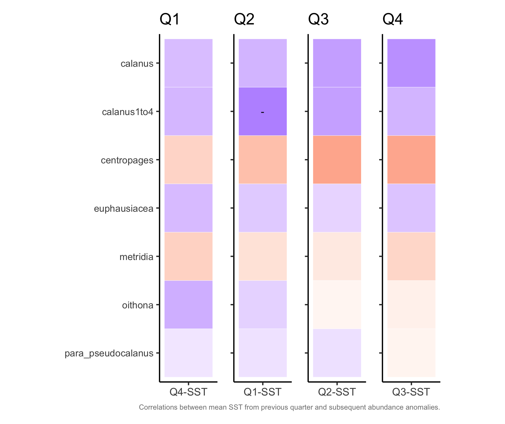
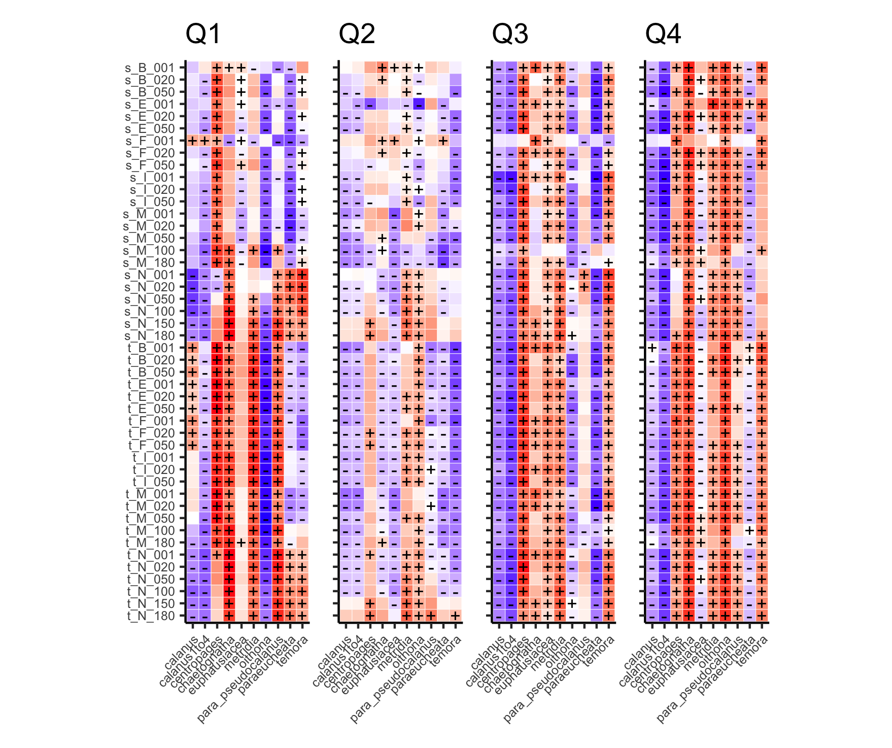
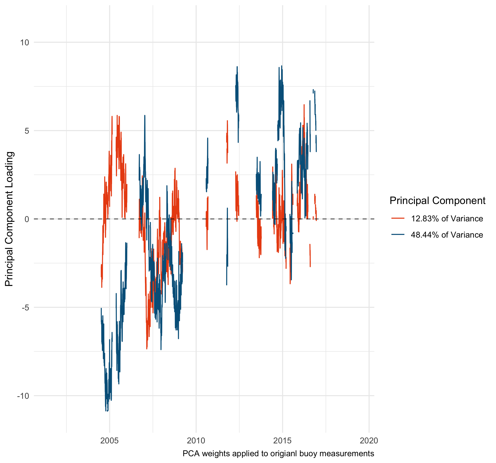
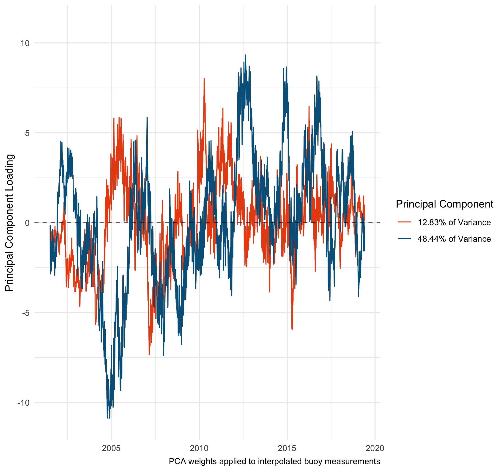

```{r setup, include=FALSE}
knitr::opts_chunk$set(echo = TRUE, message = FALSE, warning = FALSE)
options(knitr.kable.NA = '')

```

# Markdown Document Overview

This markdown doc is set up for consolidating each analysis step I've done.
 
 The first sections will mirror the steps taken in Pershing et al., 2005 in setting up the PCA and determining the weights and timelines for each time-period as shown in the following figure.


**Data and Packages**

```{r data import}
####  Packages  ####
library(patchwork)
library(ggbiplot)
library(tidyverse)
library(here)

####  Functions  ####
source(here::here("R", "cpr_helper_funs.R"))

#Set ggplot theme
theme_set(theme_minimal())

####  Load Data  ####

####  Annual/bi-monthly CPR anomalies  ####
cpr_bimonthly <- read_csv(str_c(cpr_boxpath, "data", "processed_data", "cpr_with_SSTlags.csv", 
                                sep = "/"), col_types = cols())  

#Factor manipulation
cpr_bimonthly <- cpr_bimonthly %>% 
  mutate(period = case_when(
    period == "annual" ~ "Annual",
    period == "jf" ~ "January - February",
    period == "ma" ~ "March - April",
    period == "mj" ~ "May - June",
    period == "ja" ~ "July - August",
    period == "so" ~ "September - October",
    period == "nd" ~ "November - December"),
period = factor(period, levels = c("Annual", "January - February", "March - April", 
                                   "May - June", "July - August", "September - October", 
                                   "November - December")))


####  Quarterly CPR Data with SST  ####
#with quarterly sst measurements and a one-period lag - souce: 02b_quarterly_cpr_sst_regressions
cpr_sst <- read_csv(str_c(cpr_boxpath, "data/processed_data/quarterly_cpr_sst.csv", sep = "/"), 
          col_names = TRUE,
          col_types = cols())


####   Buoy Data  ####
#Raw - source: 10_buoy_daily_interpolations
buoy_raw <- read_csv(str_c(cpr_boxpath, "data/processed_data/buoy_pcadat_raw.csv", sep = "/"),
                     col_types = cols(),
                     guess_max = 1e5)

buoy_pca_mat <- buoy_raw %>% 
  column_to_rownames(var = "Date") %>% 
  as.matrix()

#Interpolated NA's - source: 10_buoy_daily_interpolations
buoy_i <- read_csv(str_c(cpr_boxpath, "data/processed_data/buoy_pcadat_interpolated.csv", sep = "/"),
                   col_types = cols())
```


# CPR Community Changes Over Time {.tabset .tabset-pills}

Parallel methods are used for each of the following three periods of the continuous plankton recorder dataset:

 1. All available years (1961 - 2017)   
 2. The early period (1961 - 2003)   
 3. The Most recent and warmest period (2003 - 2017)   


**Analysis Code**

```{r analysis loop}
#Split into analysis units
full_ts <- cpr_bimonthly
pre_split <- cpr_bimonthly %>% filter(year <= 2003)
post_split <- cpr_bimonthly %>% filter(year > 2003)

#Put the full data sets into a nested list
analysis_sets <- list("Full Timeseries" = list(data = full_ts),
                      "1961 - 2003"     = list(data = pre_split),
                      "2004 - 2017"     = list(data = post_split))

#Function for extracting %variance explained from PCA object
pull_deviance <- function(pca_sdev) {
  
  eigs <- pca_sdev ^ 2
  
  deviance_df <- rbind(
    SD = sqrt(eigs),
    Proportion = eigs/sum(eigs),
    Cumulative = cumsum(eigs)/sum(eigs))
  
  pca_dev_out <- data.frame(
    "PC1" = str_c(as.character(round(deviance_df[2,1] * 100, 2)), "% of Variance"),
    "PC2" = str_c(as.character(round(deviance_df[2,2] * 100, 2)), "% of Variance"))
  
  return(pca_dev_out)
  
}

# Perform all analyses on this list for consistency and for organization

####  Analysis Loop  ####
for (i in 1:length(analysis_sets)) {
  
  #Keep years with the data going into distance matrices for PCA and clustering
  analysis_sets[[i]]$pca_data <- analysis_sets[[i]]$data %>% 
    filter(period == "Annual") %>% 
    pivot_wider(names_from = species, values_from = anomaly) %>% 
    mutate(decade = factor(floor_decade(year))) %>% 
    select(year, decade, calanus:para_pseudocalanus) %>% 
    drop_na()
  
  #Pull out just the values used for PCA and clustering
  analysis_sets[[i]]$anom_mat <- analysis_sets[[i]]$pca_data %>% select(-year, -decade)
  
  
  #PCA Object
  analysis_sets[[i]]$pca_obj <- prcomp(analysis_sets[[i]]$anom_mat, center = F, scale. = F)
  
  #PCA Leading Modes
  analysis_sets[[i]]$leading_modes <- rownames_to_column(as.data.frame(analysis_sets[[i]]$pca_obj$rotation)) %>%
    dplyr::select(species = rowname, PC1, PC2)
  
  #Percent Deviance Explained (To slide into plots)
  analysis_sets[[i]]$deviance_explained <- pull_deviance(analysis_sets[[i]]$pca_obj$sdev)
  
  #Figure 2a
  analysis_sets[[i]]$fig2a <- analysis_sets[[i]]$leading_modes %>%
    gather(key = "PC", value =  "Principal Component Weight", PC1, PC2) %>%
    mutate(species = factor(species,
                            levels = c("calanus", "centropages", "oithona","para_pseudocalanus",
                                       "metridia", "calanus1to4", "euphausiacea")),
           PC = if_else(PC == "PC1", 
                       as.character(analysis_sets[[i]]$deviance_explained$PC1),
                       as.character(analysis_sets[[i]]$deviance_explained$PC2))
           ) %>%
    ggplot(aes(species, `Principal Component Weight` * -1, fill = PC)) +
      geom_col(position  = "dodge") +
      scale_fill_gmri(palette = "mixed") +
      labs(x = "") +
      theme(#legend.position = c(0.85, 0.85),
            axis.text.x = element_text(angle = 45, hjust = 1))
  
}


```

---

## PCA Weights {.tabset}

### Full TS

```{r}
analysis_sets$`Full Timeseries`$fig2a
```


### Early Period

```{r}
analysis_sets$`1961 - 2003`$fig2a
```

### Last 14 Years


```{r}
analysis_sets$`2004 - 2017`$fig2a
```


## PCA Timelines {.tabset}

Taking the PCA weights from the 1961-2003 PCA (mimicking the 2005 paper) we can recreate the original timeline and extend those weights out through 2017 to create the following figures:

### Original Time-period



### Extended Through 2017


### Applying 1961-2005 Weights to 91-Day Quarters

When applying 1961-2005 PCA weights to the bi-monthly period anomalies and extend them out through 2017 you get this figure.


```{r, eval = FALSE}
#Mirror the code for the bimonthly modes plot, but here for the quarters

####  Bi-Monthly Periods  ####
cpr_wide <- cpr_sst %>% select(year, period, species, anomaly) %>% 
  pivot_wider(names_from = species, values_from = anomaly)

quarterly_list <- cpr_wide %>% 
  split(.$period) %>%  
  map(function(x) {
    x %>% dplyr::select(year, calanus, centropages, oithona, para_pseudocalanus, 
                          metridia, calanus1to4, euphausiacea) %>% drop_na()
  })

#CPR Gap years
all_years <- tibble(year = rep(c(1975, 1976),2),
                        PC = c(rep("First Mode", 2), c(rep("Second Mode", 2)))
                        )

#Map the weights of the pca from the first mode
mode_1 <- quarterly_list %>% 
  map(function(x) {
    x <- x %>% 
      apply_pca_load(pca_load = .,
                     pca_rotations = analysis_sets$`1961 - 2003`$pca_obj$rotation,
                     mode_num = 1) %>% 
      rowSums() %>% 
      as.data.frame()  %>% 
      mutate(PC = "First Mode")
  colnames(x)[1] <- "Principal component value"
  return(x)}
    ) %>% 
  map2(quarterly_list, function(x, y) {
    dplyr::select(y, year) %>% 
      bind_cols(x)  %>% 
      full_join(all_years)
  })

#Map the weights of the pca from the second mode
mode_2 <- quarterly_list %>% 
  map(function(x) 
  {x <- x %>% 
    apply_pca_load(pca_load = .,
                   pca_rotations = analysis_sets$`1961 - 2003`$pca_obj$rotation,
                   mode_num = 2) %>% 
    rowSums() %>% 
    as.data.frame()  %>% 
    mutate(PC = "Second Mode")
  colnames(x)[1] <- "Principal component value"
  return(x)}
  ) %>% 
  map2(quarterly_list, function(x, y) {
    dplyr::select(y, year) %>% 
      bind_cols(x) %>% 
      full_join(all_years)
  })

quarterly_out <- bind_rows(mode_1, mode_2, .id = "period")


#Both
(quarterly_plots <- quarterly_out %>% 
  ggplot() +
    geom_rect(xmin = 1990, xmax = 2000, ymin = -3, ymax = 3, fill = "gray90", alpha = 0.05) +
    geom_rect(xmin = 2010, xmax = 2017, ymin = -3, ymax = 3, fill = "gray90", alpha = 0.05) +
    geom_hline(yintercept = 0, color = "royalblue", linetype = 2, alpha = 0.2) +
    geom_line(aes(year, `Principal component value` * -1, color = PC)) +
    scale_color_gmri(palette = "mixed") +
    scale_x_continuous(breaks = c(1960, 1970, 1980, 1990, 2000, 2010)) +
    theme_classic() +
    theme(legend.position = "none") +
    facet_wrap( ~ period, ncol = 2) +
    labs(x = NULL))
ggsave(plot = quarterly_plots, filename = here::here("R", "presentations", "quarterly_modes.png"), device = "png")


```


# CPR Anomaly Correlation with SST  {.tabset .tabset-pills}

Using quarterly averages in seas surface temperature anomalies we can compare the relationships between abundance anomalies and the simultaneous sea-surface temperature anomalies, as well as the sea surface anomalies from the previous 91-day period.

## Simultaneous SST Conditions with CPR Anomalies




## CPR Anomalies with Prior Period's SST



# Buoy Correlations with CPR Anomalies  {.tabset .tabset-pills}

Across the Gulf of Maine region there are a number of NERACOOS buoys recording real-time measurements at various depths. These measurements give a more fine-scale sense of oceanographic changes and should more acurately capture climate-modes hypothesized to influence plankton community structure.

## Individual Correlations - Sensors & Taxa

The relationship between any given taxa and the measurements of a specific buoy on a quarterly observation level can be viewed using the [buoy regression shiny app](https://adamkemberling.shinyapps.io/cpr_buoy_DE/)


## Quarterly Correlation Plot

These individual relationships can also be viewed in the following correlation plot. `+` and `-` symbols indicate a significant positive or negative relationship.



# Buoy Sensor PCA {.tabset .tabset-pills}

Buoy readings are available at a much finer resolution than the SST and CPR dataset, and capture a more detailed image of the physical environment. 

## Buoy PCA Weights

```{r, out.height = 600, out.width = 800}
#Buoy Daily PCA
buoy_pca_mat <- buoy_raw %>% 
  column_to_rownames(var = "Date") %>% 
  as.matrix()

####  PCA on physical measurements  ####
daily_pca <- prcomp(na.omit(buoy_pca_mat), center = FALSE, scale. = FALSE)

#PCA Leading Modes
leading_modes <- rownames_to_column(as.data.frame(daily_pca$rotation)) %>%
    dplyr::select(sensor_id = rowname, PC1, PC2)
  
#Percent Deviance Explained (To slide into plots)
deviance_explained <- pull_deviance(daily_pca$sdev)
  
#Plotting Buoy Weights
buoy_weights <- leading_modes %>%
  gather(key = "PC", value =  "Principal Component Weight", PC1, PC2) %>%
  mutate(PC = if_else(PC == "PC1", 
                     as.character(analysis_sets[[i]]$deviance_explained$PC1),
                     as.character(analysis_sets[[i]]$deviance_explained$PC2)),
         buoy_id = str_sub(sensor_id, -1, -1),
         buoy_type = if_else(buoy_id %in% c("M", "N"), "Offshore", "Nearshore"),
         reading_depth = str_sub(sensor_id, -6, -4),
         reading_depth = str_c(reading_depth, " m"),
         reading_depth = str_replace_all(reading_depth, "001", "1"),
         reading_depth = str_replace_all(reading_depth, "010", "10"),
         reading_depth = str_replace_all(reading_depth, "020", "20"),
         reading_depth = str_replace_all(reading_depth, "050", "50"),
         reading_depth = if_else(buoy_id == "M" & reading_depth == "150 m", 
                                 "180 m", reading_depth),
         reading_depth = factor(reading_depth, 
                                levels = c("1 m", "10 m", "20 m", 
                                           "50 m", "100 m", "150 m", "180 m")),
         var_id = str_sub(sensor_id, 1, 1),
         var_id = if_else(var_id == "s", "Salinity", "Temperature")
         )


buoy_weights %>% 
  ggplot(aes(reading_depth, `Principal Component Weight`, fill = PC)) +
    geom_col(position  = "dodge") +
    scale_fill_gmri(palette = "mixed") +
    labs(x = "") +
    facet_grid(var_id ~ buoy_id) +
    theme_bw() +
    theme(axis.text.x = element_text(angle = 90, vjust = 0.2))

```


## Buoy Timeline - Original Data


## Buoy Timeline - Original Data with Gaps Interpolated


