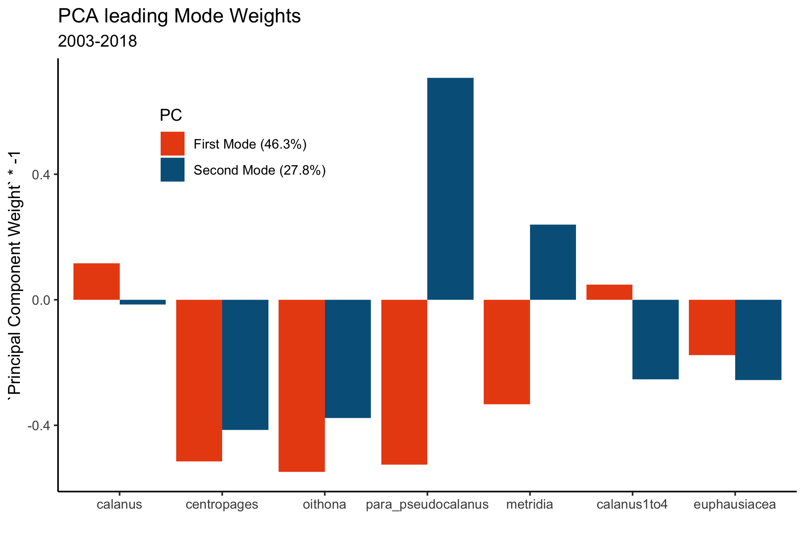

---
output:
  xaringan::moon_reader:
    lib_dir: libs
    nature:
      seal: FALSE
      highlightStyle: github
      highlightLines: true
      countIncrementalSlides: false
editor_options: 
  chunk_output_type: console
---
background-image: url(gmri_ppt_template_WIDE_2018.png)
background-size: 100%
class: inverse, center, middle

# Continuous Plankton Recorder Project


### Revisiting Pershing et al. 2005
.large[Adam A. Kemberling | Quantitative Technician | 20 Nov 2019]

---

layout: true
background-image: url(gmri_logo.png)
background-position: 1% 99%
background-size: 10%

---
name: title
class:  middle, top

```{r setup, include=FALSE, message = FALSE, warning = FALSE}
options(htmltools.dir.version = FALSE)
knitr::opts_chunk$set(echo = FALSE, comment = NA, warning = FALSE, message = FALSE, fig.retina = 3)
options(knitr.kable.NA = '')

####  Packages  ####
library(ggbiplot)
library(ggpmisc)
library(tidyverse)
library(here)
library(DT)
#devtools::install_github("vqv/ggbiplot")


####  Functions  ####
find_box_data <- function(box_project_name) {
  box_project <- as.character(box_project_name)
  box_path <- str_c("/Users/akemberling/Box/Adam Kemberling/Box_Projects/", paste(box_project))
  return(box_path)
}

cpr_boxpath <- find_box_data("continuous_plankton_recorder")
gmricols_boxpath <- find_box_data("R_exercise_library/gmri_colors/gmripalette/R")

source(str_c(gmricols_boxpath, "/gmri_colors.R"))
floor_decade <- function(value){ return(value - value %% 10) }


#Set ggplot theme
theme_set(theme_classic())

####  Load Data  ####

# SST long-format with the lag periods
sst_long_lagged <- read_csv(str_c(cpr_boxpath, "data", "processed_data", "SST_with_lags.csv", sep = "/")) %>% 
  mutate(period = case_when(
    period == "annual" ~ "Annual",
    period == "jf" ~ "January - February",
    period == "ma" ~ "March - April",
    period == "mj" ~ "May - June",
    period == "ja" ~ "July - August",
    period == "so" ~ "September - October",
    period == "nd" ~ "November - December"),
period = factor(period, 
                levels = c("Annual", "January - February", "March - April", "May - June", "July - August", "September - October", "November - December")))

# CPR species Data with the corrresponding SST
species_periods_long <- read_csv(str_c(cpr_boxpath, "data", "processed_data", "cpr_with_SSTlags.csv", sep = "/"))  %>% 
  mutate(period = case_when(
    period == "annual" ~ "Annual",
    period == "jf" ~ "January - February",
    period == "ma" ~ "March - April",
    period == "mj" ~ "May - June",
    period == "ja" ~ "July - August",
    period == "so" ~ "September - October",
    period == "nd" ~ "November - December"),
period = factor(period, 
                levels = c("Annual", "January - February", "March - April", "May - June", "July - August", "September - October", "November - December")))

```

# Pershing et al. 2005

.pull-left[

  **Data**

 * 42 Years of Zooplankton Data (1961 - 2003)

 * 6 Zooplankton species (2 Calanaus age-groups)
]

.pull-right[

  **Findings**
  
  * Two Dominant PCA Modes
  
  * Decadal variation in Plankton Communities
  
  * Two Zooplankton-communities associated with PCA modes
  
  * Temperature thought to drive shift between modes

]


---
class: top, center


```{r  out.height = 600}
# local
knitr::include_graphics("pershing05_recreations/pershing_05_PCA.png") 

# For pasting images outside of code blocks use:
#


```

---
class: top, middle

# Recreating the 2005 PCA

 ###1. Re-run PCA on 1961-2003 Plankton Population Anomaly Data
 ###2. Project Weights from 2 Major Principal Components onto More Recent Data (2003 - 2017)
 ###3. Compare Most Recent Decade (Warmest Decade on Record) to the 90's
 ###4. Temperature's Relationship on Individual Abundances and PCA modes

---
class: top
### 1a. Re-run PCA on 1961-2003 Plankton Population Anomaly Data


```{r figure 2a, out.height = 500}
# local
knitr::include_graphics("pershing05_recreations/Figure2a_recreation.png") 

```

---
class: top
### 1b. Re-run PCA on 1961-2003 Plankton Population Anomaly Data

```{r figure 2b,  out.height = 500}
# local
knitr::include_graphics("pershing05_recreations/Figure2b_recreation.png") 

```


---
class: top
### 2a. Project PCA Weights Forward to 2018

```{r  out.height = 500}
# local
knitr::include_graphics("pershing05_recreations/Figure2b_full.png") 

```

---
class: top
### 2b. PCA Bi-plot

```{r  out.height = 500}
# local
knitr::include_graphics("pershing05_recreations/2005pca_biplot.png") 

```


---
class: top

### Trends in SST - Gulf of Maine

.pull-left[
```{r, out.height=450}
sst_long_lagged %>% filter(period == "Annual") %>% 
  ggplot(aes(year, temp_anomaly)) +
    geom_hline(yintercept = 0, color = "darkred", alpha = 0.3, linetype = 2) +
    geom_line(group = 1) +
    geom_smooth(method = "loess", color = gmri_cols("gmri blue")) +
    facet_wrap(~period, ncol = 1) +
    labs(x = NULL, y = NULL)
```

]


.pull-right[
```{r, out.height=450}
sst_long_lagged %>% filter(period != "Annual") %>% 
  ggplot(aes(year, temp_anomaly)) +
    geom_hline(yintercept = 0, color = "darkred", alpha = 0.3, linetype = 2) +
    geom_line(group = 1) +
    geom_smooth(method = "loess", color = gmri_cols("gmri blue")) +
    facet_wrap(~period, ncol = 2) +
    scale_x_continuous(breaks = c(1980, 1990, 2000, 2010)) +
    labs(x = NULL, y = NULL)
```
]

---
class: top

### SST Increases - Last ~15 Years

.pull-left[
```{r, out.height=450}
sst_annual <- sst_long_lagged %>% filter(period == "Annual")

#GG color hues
#It is just equally spaced hues around the color wheel, starting from 15:
gg_color_hue <- function(n) {
  hues = seq(15, 375, length = n + 1)
  hcl(h = hues, l = 65, c = 100)[1:n]
}

#For example:

n = 2
cols = gg_color_hue(n)

sst_annual %>% 
  ggplot(aes(year, temp_anomaly)) +
    geom_hline(yintercept = 0, color = "darkred", alpha = 0.3, linetype = 2) +
    geom_line(group = 1) +
    geom_smooth(data = filter(sst_annual, year <= 2010),
                aes(year, temp_anomaly, color = "1982 - 2010"),
                method = "lm") +
    geom_smooth(data = filter(sst_annual, year >= 2000),
                  aes(year, temp_anomaly, color = "2000 - 2018"),
                  method = "lm") +
    stat_poly_eq(data = filter(sst_annual, year <= 2010),
                 formula = y ~ x, 
                 aes(label = paste(..eq.label.., "~\n~", ..rr.label..)), 
                 label.y = 0.0125,
                 #geom = "debug", #checks what labels are available
                 parse = TRUE, 
                 color = cols[1]) + 
    stat_poly_eq(data = filter(sst_annual, year >= 2000),
                 formula = y ~ x, 
                 aes(label = paste(..eq.label.., "~\n~", ..rr.label..)), 
                 label.x = 0.75,
                 label.y = 0.85,
                 #geom = "debug", #checks what labels are available
                 parse = TRUE, 
                 color = cols[2]) + 
    guides(color = guide_legend(title = NULL)) +
      facet_wrap(~period, ncol = 1) +
      labs(x = NULL, y = NULL) +
      theme(legend.position = c(0.85, 0.2))


# #One off plot of annual temperature changes
# annual_changes <- sst_annual %>% 
#   ggplot(aes(year, temp_anomaly)) +
#     geom_hline(yintercept = 0, color = "darkred", alpha = 0.3, linetype = 2) +
#     geom_line(group = 1) +
#     geom_smooth(data = filter(sst_annual, year <= 2010),
#                 aes(year, temp_anomaly, color = "1982 - 2010"),
#                 method = "lm") +
#     geom_smooth(data = filter(sst_annual, year >= 2000),
#                   aes(year, temp_anomaly, color = "2000 - 2018"),
#                   method = "lm") +
#     guides(color = guide_legend(title = NULL)) +
#     labs(x = NULL, y = NULL, caption = "Gulf of Maine: Sea Surface Temperature Anomalies") +
#     theme(legend.position = c(0.9, 0.15),
#           rect = element_rect(fill = "transparent"))
# 
# ggsave(annual_changes, filename = "/Users/akemberling/Documents/Repositories/continuous_plankton_recorder/R/presentations/sst_plots/sst_split_timeline.png", device = "png")

```

]


.pull-right[
```{r, out.height=450}
sst_periods <- sst_long_lagged %>% filter(period != "Annual")

sst_periods %>% 
  ggplot(aes(year, temp_anomaly)) +
    geom_hline(yintercept = 0, color = "darkred", alpha = 0.3, linetype = 2) +
    geom_line(group = 1) +
    geom_smooth(data = filter(sst_periods, year <= 2010),
                aes(year, temp_anomaly, color = "1982 - 2010"),
                method = "lm", show.legend = FALSE) +
    geom_smooth(data = filter(sst_periods, year >= 2000),
                  aes(year, temp_anomaly, color = "2000 - 2018"),
                  method = "lm", show.legend = FALSE) + 
    stat_poly_eq(data = filter(sst_periods, year <= 2010),
                 formula = y ~ x, 
                 aes(label = paste(..eq.label.., "~\n~", ..rr.label..)), 
                 label.y = 0.0125,
                 #geom = "debug", #checks what labels are available
                 parse = TRUE, 
                 color = cols[1]) + 
    stat_poly_eq(data = filter(sst_periods, year >= 2000),
                 formula = y ~ x, 
                 aes(label = paste(..eq.label.., "~\n~", ..rr.label..)), 
                 label.x = 0.75,
                 label.y = 0.85,
                 #geom = "debug", #checks what labels are available
                 parse = TRUE, 
                 color = cols[2]) + 
    scale_x_continuous(breaks = c(1980, 1990, 2000, 2010)) +
    guides(color = guide_legend(title = NULL)) +
      facet_wrap(~period, ncol = 2) +
      labs(x = NULL, y = NULL)
```
]

---
class: top


<br/>

```{r, out.height=400}
#Function for pulling f-test p-values for a linear model
lmp <- function (modelobject) {
	if (class(modelobject) != "lm") stop("Not an object of class 'lm' ")
	f <- summary(modelobject)$fstatistic
	p <- pf(f[1],f[2],f[3],lower.tail=F)
	attributes(p) <- NULL
	return(p)
}

lm_summaries <- sst_long_lagged %>% 
  mutate(Year_split = ifelse(year <= 2000, "1982-2000", "2000-2017")) %>% 
  group_by(Year_split, period) %>% 
  nest() %>% 
  mutate(linear_mod = map(data, function(data) lm(temp_anomaly ~ year, data)),
         pvals = map(linear_mod, lmp)) %>% 
  unnest(pvals) %>% 
  select(period, Year_split, pvals) %>% 
  split(.$Year_split) %>%
  bind_cols() %>%
  ungroup() %>% 
  mutate_if(is.numeric, round, 3)
  

names(lm_summaries) <- c("Bi-monthly Period", "Early Years", "pval", "Bi-monthly Period", "Recent Years", "pval")
library(formattable)

lm_summaries %>% 
  #formattable()
  # knitr::kable()
  DT::datatable(options=list(
       pageLength = 7,
       lengthMenu = FALSE,
       searching= FALSE ))
  
```


---
class: top, center

### SST + Zooplankton PCA Modes


```{r original ts plot, out.height = 500}

knitr::include_graphics("pershing05_recreations/2005_ts_temps.png") 

```

---
class: top, center

### 05' PCA Modes - Extended to 2018


```{r full ts plot, out.height = 500}
knitr::include_graphics("pershing05_recreations/full_ts_temps.png") 


```

---
class: top, center

### Annual Zooplankton & Temperature Correlations All Years

```{r full ts corrplot, out.height = 500}
knitr::include_graphics("corrplots/bimonthly/corrplot_full.png") 


```


---
class: top, center

### Annual Zooplankton & Temperature Correlations 1982-2003

```{r pre shift annual corrplot, out.height = 500}
knitr::include_graphics("corrplots/bimonthly/corrplot_pre.png") 


```

---
class: top, center

### Annual Zooplankton & Temperature Correlations 2003-2018

```{r post shift annual corrplots, out.height = 500}
knitr::include_graphics("corrplots/bimonthly/corrplot_post.png") 


```

---
class: top, center

### Annual Zooplankton & Period Temperature Correlations 1982-2018

```{r seasonal corrplots, out.height = 500}
knitr::include_graphics("corrplots/bimonthly/all_seasons.png") 


```


---
class: top, center

### PCA Weights - Using Full Timeseries

```{r full ts pca weights, out.height = 500}
 

```

---
class: top, center

### PCA Weights - Post 2003 Data Only

```{r 2003 pca weights, out.height = 500}
 

```

